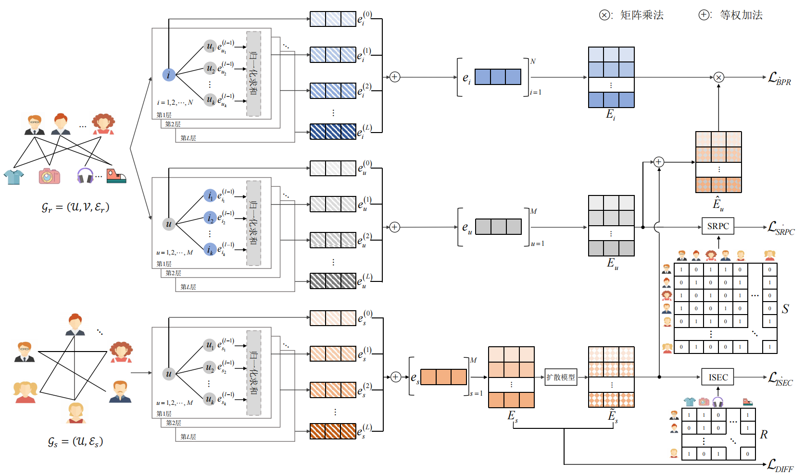
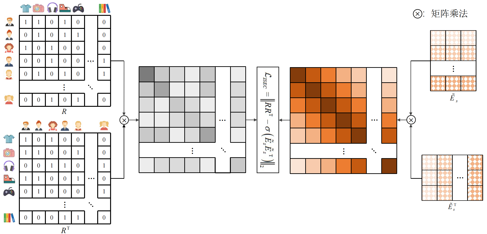
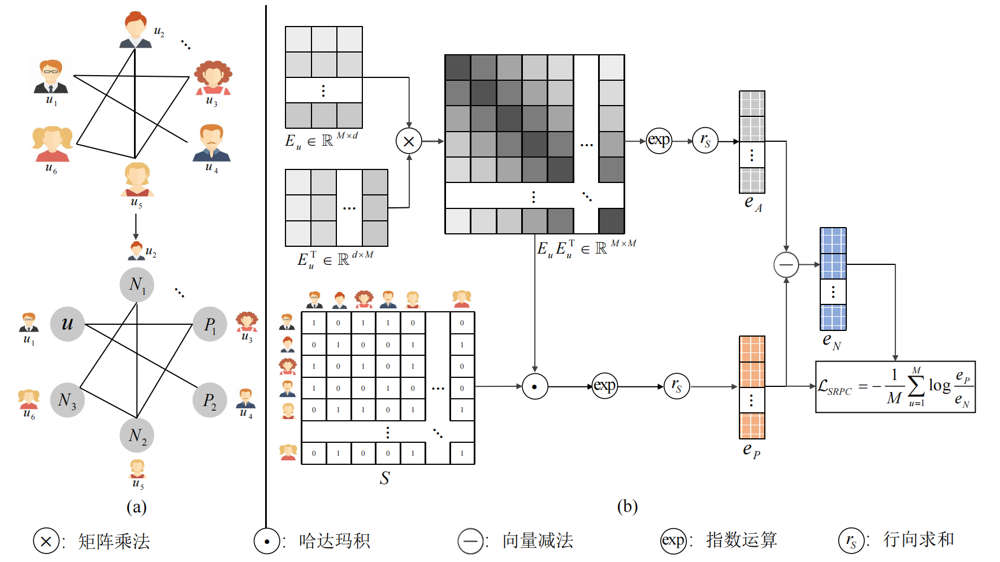

# HUIR: Harnessing the Reciprocal Influence of Social Connections and User Interactions for Recommendation
## Requirements
```text
python = 3.10.18
torch = 2.2.0
torch-geometric = 2.3.1
numpy = 1.26.4
scipy = 1.15.3
pandas = 2.3.0
tqdm = 4.67.1
scikit-learn = 1.4.0
```

## 📌 Overview
The overview of HUIR:


The overview of ISEC:


The overview of SRPC:


## Datasets
We evaluate HUIR on three public multimodal recommendation datasets: flickr, ciao, and douban.

| Dataset | # Users | # Items | # Interactions | # Social Links | Rating Density |
|:--|--:|--:|--:|--:|:--|
| flickr | 8,358 | 82,120 | 327,815 | 352,952 | 0.048% |
| ciao | 1,925 | 15,053 | 33,175 | 65,084 | 0.114% |
| douban | 2,848 | 39,586 | 894,887 | 35,770 | 0.794% |


## Training

If you want to run the RGCML, you need to create the `History/`+'dataset_name (e.g,ciao)' and the `Models/`+ 'dataset_name (e.g,ciao)' directories.The recommended hyperparameters for ciao, douban, and flickr are provided in:

### ciao

```bash
python main.py --dataset='ciao' --checkpoint='./Model/ciao/_tem_.pth' --model_dir='./Model/ciao/' --s_layers=4
```

### douban

```bash
python main.py --dataset='douban' --checkpoint='./Model/douban/_tem_.pth' --model_dir='./Model/douban/' --lr=5e-4 --difflr=5e-4 --decay=0.98 --reg=1e-8 --noise_max=0.01 --SRPCloss=0.01 --ISECloss=1e-4 --bprloss=1.5
```

### flickr

```bash
python main.py --dataset='flickr' --checkpoint='./Model/flickr/_tem_.pth' --model_dir=  './Model/flickr/' --difflr=5e-4 --noise_min=1e-6 --noise_max=0.05 --SRPCloss=0.5 --ISECloss=5e-3 --bprloss=10
```


## Acknowledgement

This code is developed based on the implementation of [RecDiff](https://github.com/HKUDS/RecDiff). We sincerely thank the authors of RecDiff for their excellent work and for making their code publicly available, which provides an important foundation for this project.
